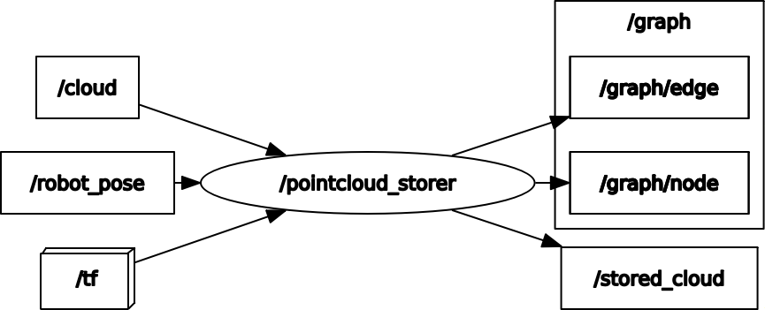

# pointcloud_storer_ros


[](https://opensource.org/licenses/MIT)

ROS package for storing pointclouds and poses

The demo assumes that a portion of the scan data has been acquired

<p align="center">
  
</p>

## Environment
- Ubuntu 20.04
- ROS Noetic

## Install and Build
```
# clone repository
cd /path/to/your/catkin_ws/src
git clone https://github.com/ToshikiNakamura0412/pointcloud_storer_ros.git

# build
cd /path/to/your/catkin_ws
rosdep install -riy --from-paths src --rosdistro noetic       # Install dependencies
catkin build pointcloud_storer_ros -DCMAKE_BUILD_TYPE=Release # Release build is recommended
```

## How to use
```
roslaunch pointcloud_storer_ros pointcloud_storer.launch
```

## Running the demo
```
# clone repository
cd /path/to/your/catkin_ws/src
git clone https://github.com/ToshikiNakamura0412/emcl_ros.git
git clone https://github.com/ToshikiNakamura0412/scan_to_pcl_ros.git
git clone https://github.com/ToshikiNakamura0412/amr_navigation_utils_ros.git
git clone https://github.com/ToshikiNakamura0412/raycast_mapping_ros.git
git clone -b noetic-devel https://github.com/ROBOTIS-GIT/turtlebot3_msgs.git
git clone -b noetic-devel https://github.com/ROBOTIS-GIT/turtlebot3.git
git clone -b noetic-devel https://github.com/ROBOTIS-GIT/turtlebot3_simulations.git

# build
cd /path/to/your/catkin_ws
rosdep install -riy --from-paths src --rosdistro noetic
catkin build -DCMAKE_BUILD_TYPE=Release

# run demo
## terminal 1
export TURTLEBOT3_MODEL=burger
roslaunch pointcloud_storer_ros test.launch
## terminal 2
export TURTLEBOT3_MODEL=burger
roslaunch turtlebot3_teleop turtlebot3_teleop_key.launch
```

## Node I/O


### Runtime requirement
TF (from the frame_id of cloud to the frame_id of robot_pose) is required

## Nodes
### pointcloud_storer
#### Published Topics
- ~\<name>/graph/edge (`nav_msgs/Path`)
  - Edge of pose graph
- ~\<name>/graph/node (`geometry_msgs/PoseArray`)
  - Node of pose graph
- ~\<name>/stored_cloud (`sensor_msgs/PointCloud2`)
  - Stored pointcloud

#### Subscribed Topics
- /cloud (`sensor_msgs/PointCloud2`)
  - Input pointcloud
- /robot_pose (`geometry_msgs/PoseWithCovarianceStamped`)
  - Robot pose

#### Parameters
- ~\<name>/<b>store_num</b> (int, default: `3`):<br>
  The number of pointclouds to store
- ~\<name>/<b>interval</b> (float, default: `0.5` [m]):<br>
  The interval between stored pointclouds
- ~\<name>/<b>leaf_size</b> (float, default: `0.05` [m]):<br>
  The leaf size of voxel grid filter
